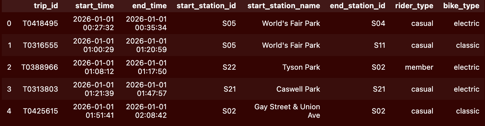

# Ride Knox Data Analysis 2025-2026

## Overview: Ridership declined in the second half of 2025, does the data from 2026 suggest it recovers? What additional stations could be added where capacity is high?

## Data:
- **Data:** 247,967 cleaned trips across 24 stations
- **Tools:** Python, pandas, matplotlib

Trips columns: 'trip_id', 'start_time', 'end_time', 'start_station_id',
       'start_station_name', 'end_station_id', 'rider_type', 'bike_type'

Stations columns: 'station_id', 'station_name', 'neighborhood', 'latitude', 'longitude',
       'docks', 'year_installed'

## Raw files are **not** in this repo (~22 MB, and the golden rule: never edit raw data).

Request `trips_2025.csv` and `stations.xlsx` from the Ride Knox data team.
`trips_2025.csv` — one row per trip:

| column | type | notes |
| ------------------------------- | -------- | ---------------------------------- |
| trip_id | str | unique, T-series |
| start_time / end_time | datetime | stored as text in the raw file |
| start_station_id | str | joins to stations.station_id |
| start_station_name | str | authoritative names in stations.xlsx |
| end_station_id | str | ~3,800 missing (kept and flagged) |
| rider_type | str | member / casual (raw has 6 spellings) |
| bike_type | str | classic / electric

## How to run:
Install requirements in the requirements.txt file
Run analysis.ipynb 

## Key Findings 

Casual ridership fell after July price increase (13,816 trips in June -> 9,088 in July), but Member ridership stayed consistent.

The implementation of a Day Pass in 2026 increased ridership, especially on weekends. 

Additional docking was resolved, with more docks at high pressure areas.

## Limitations:
Not all ridership data is included for 2026 only 6 months. Additionally, other factors such as weather or Knoxville events could be affecting usage but we cannot correlate that information with the given parameters. 

## Repo Structure:
./ride-knox-analysis
    analysis_2026.ipynb     
    COLLAB-LOG.md           
    memo_2026.md            
    report.md               
    stations.xlsx           
    WORKLOG.md
    analysis.ipynb          
    image-1.png             
    README.md               
    /scratch                 
    /charts      
        .png files from analysis.ipynb and analysis_2026.ipynb                   
    report_cora_ver.md      
    STARTER-PACK-README.md  
    WORKLOG_6.md

**analysis.ipynb --> cora's version**
**analysis_2026.ipynb --> Dr. V's version**

