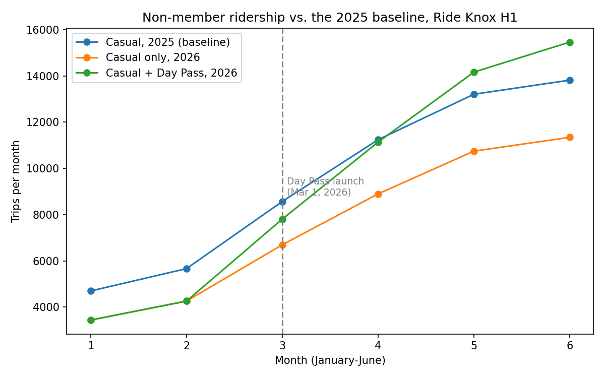

# The Day Pass Bring Weekend Riders

**After the July 2025 price increase, casual riders declined. In 2026, a new Day Pass was implemented to mitigate this change. In June 2026, casual and Day Pass riders together took 12% more trips than casual riders did in June 2025. But the Day Pass riders were riding more on the weekends than any other rider group.**

The Day Pass launched on March 1, 2026. By May (05), non-member(casual and Day Pass) trips were back above the 2025 level, and by June they were 12% higher. Member trips grew about 10% over 2025 every month, meaning Ride Knox riders are growing. The new docks at Hodges Library and the Student Union cut crowding there by about a third.

## Read the full report

1. **[2025: What happens after July price increase?](report.md)**: what happened to ridership in 2025.
2. **[2026: Did the Day Pass work?](memo_2026.md)**: the six-month verdict determining whether Day Passes would recover the decline of non-member riders.
3. **[What's new, comparing 2025 and 2026](RELEASE-NOTES.md)**: 

## For the technically curious

The data, methods, and instructions for re-running the analysis are in the **[project README](README.md)**.

*Ride Knox ridership analysis, January 2025 – June 2026.*
